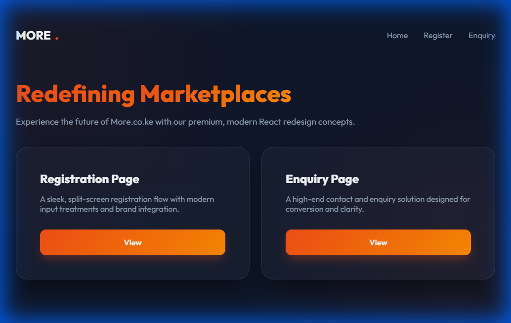
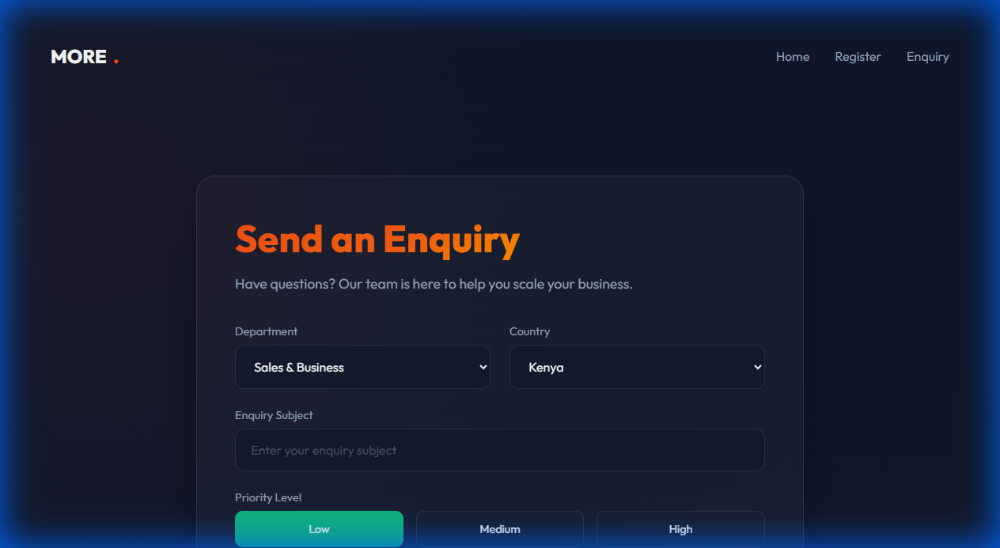

# More Classifieds Redesign (React)

## Design 

### Theme & Aesthetics
The redesign adopts a **Premium Dark** aesthetic, moving away from standard templates to a high-end, immersive experience.
- **Glassmorphism**: Extensive use of backdrop-blur effects and semi-transparent layers to create depth and a modern "glassy" feel.
- **Color Palette**: A deep navy/slate background (`#0f172a`) contrasted with the signature brand orange (`#f65016`) for primary actions.
- **Typography**: The **Outfit** sans-serif font is used throughout for its clean, geometric, and professional appearance.
- **Visual Depth**: Subtle radial gradients and card shadows create a three-dimensional interface that feels "alive."

### Component Structure
- **Responsive Grid System**: A custom-built CSS utility that adapts from multi-column layouts on desktop to clean vertical stacks on mobile.
- **Micro-interactions**: Smooth transitions on hover and focus states to provide instant user feedback.
- **Modular Components**: Reusable Navbar, GlassCard, and Form elements for design consistency.

---

## Page Overview

### 1. Home Page
A high-level landing page that showcases the design system. It uses a responsive grid of glassmorphic cards to guide users toward the new flows.

**Structure**: Header -> Hero Section -> Feature Cards -> Footer.

### 2. Registration Page
A sophisticated split-screen layout designed for high conversion.
- **Structure**: 50/50 Split on desktop. The left side is a visual/brand anchor, while the right side handles the interactive forms.
- **Dynamic Logic**: The "Full Name" label and placeholder automatically toggle to "Company Name" when the user selects the "Company" account type.
- **Social Auth**: Integrated, clean UI for one-tap login via Google or Facebook.

### 3. Robust Enquiry Form
A highly functional, data-rich form that manages complexity with style.
- **Structure**: Concentric glassmorphic cards with organized input clusters.
- **UI Elements**: 
    - **Priority Pills**: Interactive toggles for Low, Medium, and High priority.
    - **Multi-Selects**: Clean dropdowns for Department and Regional targeting (Kenya, Uganda, etc.).
    - **Attachments**: Custom-styled file upload area.

---

## Tech Stack
- **Library**: React 19
- **Environment**: Vite
- **Routing**: React Router 7
- **Styling**: Vanilla CSS3 (Custom Design System)

## Local Setup
1. Clone the repository.
2. Install dependencies: `npm install`
3. Start the dev server: `npm run dev`
4. Build for production: `npm run build`
